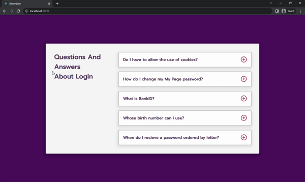

# Accordion
In this project, when clicking on the plus sign the answer appears on the screen to the question. At the same time, the plus sign turns into to minus sign.



## Used Technologies
* 

* 

* 

## Installation
First clone the project.
```
git clone https://github.com/saglamburcu/react-accordion.git
```

## Usage
After cloning the project, open it in Visual Studio Code.
```
cd react-accordion
code .
```
Download node modules to make it work
```
npm install
```
To make it work
```
npm start
```